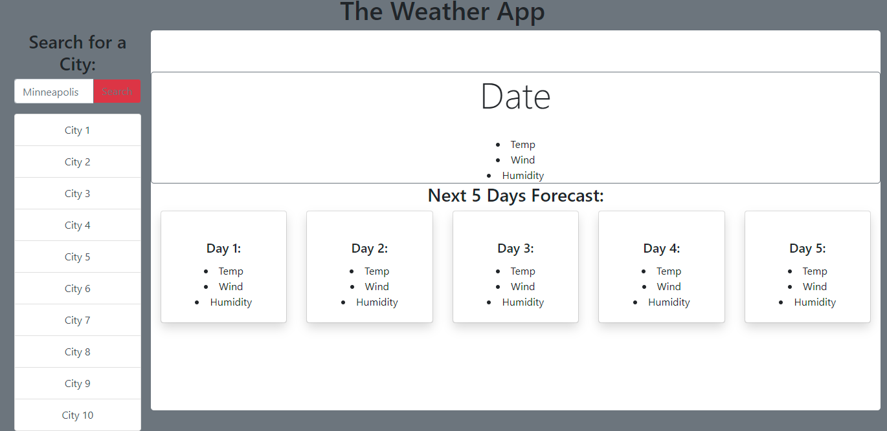

# monsoon-szn

## Description

The Weather App displays information about a city such as weather report, temperature, wind speed and humidity.

## Table of Contents

- [Installation] (#installation)
- [Usage] (#usage)
- [Credits] (#credits)
- [License] (#license)
- [Feature] (#feature)
- [Issue] (#issue)

# Installation

Open Github > Hit Green "Code" Button > Inside the Clone drop down box select method of cloning(https, ssh, github CLI) > If cloning by SSH open a terminal or git inside type > $ git clone (the ssh) then hit enter> Then Viola

# Usage

# Credits

Used old and previous contents with other outside resources such as google with led to W3, Mozilla, StackOverFlow, and documentations. Also received helped from Andrew.

# License

MIT License

Copyright (c) 2022 JuicinessJ

Permission is hereby granted, free of charge, to any person obtaining a copy
of this software and associated documentation files (the "Software"), to deal
in the Software without restriction, including without limitation the rights
to use, copy, modify, merge, publish, distribute, sublicense, and/or sell
copies of the Software, and to permit persons to whom the Software is
furnished to do so, subject to the following conditions:

The above copyright notice and this permission notice shall be included in all
copies or substantial portions of the Software.

THE SOFTWARE IS PROVIDED "AS IS", WITHOUT WARRANTY OF ANY KIND, EXPRESS OR
IMPLIED, INCLUDING BUT NOT LIMITED TO THE WARRANTIES OF MERCHANTABILITY,
FITNESS FOR A PARTICULAR PURPOSE AND NONINFRINGEMENT. IN NO EVENT SHALL THE
AUTHORS OR COPYRIGHT HOLDERS BE LIABLE FOR ANY CLAIM, DAMAGES OR OTHER
LIABILITY, WHETHER IN AN ACTION OF CONTRACT, TORT OR OTHERWISE, ARISING FROM,
OUT OF OR IN CONNECTION WITH THE SOFTWARE OR THE USE OR OTHER DEALINGS IN THE
SOFTWARE.

# Feature

An App which ask for a city then displays information of that city.

# Issue

Due to using that API which only counts up to 40. I was not able to get the 5th day information. Which means the jumbotron and first card will have the same information. Tried finding a fix by adding a parameter for the API URL using "&cnt=41" and had no luck. Spent a few minutes only probably could find a fix if had used a different API or newer version than 2.5.